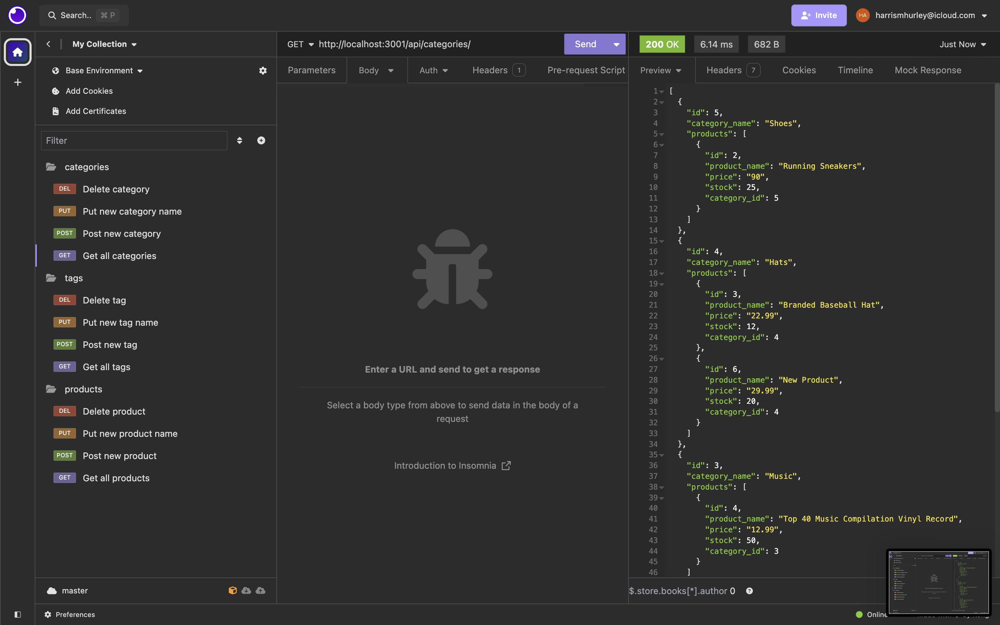
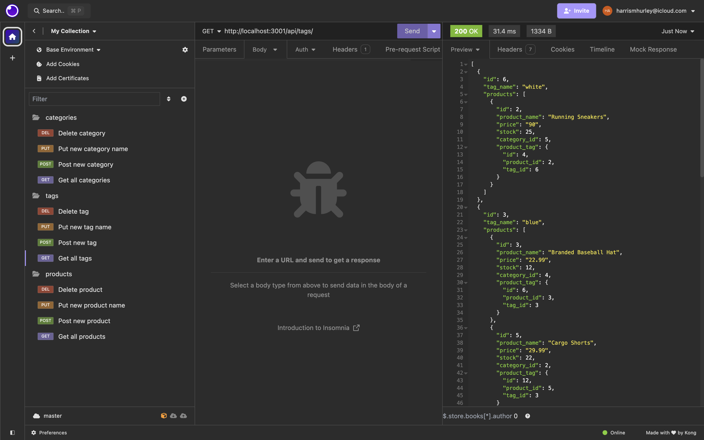
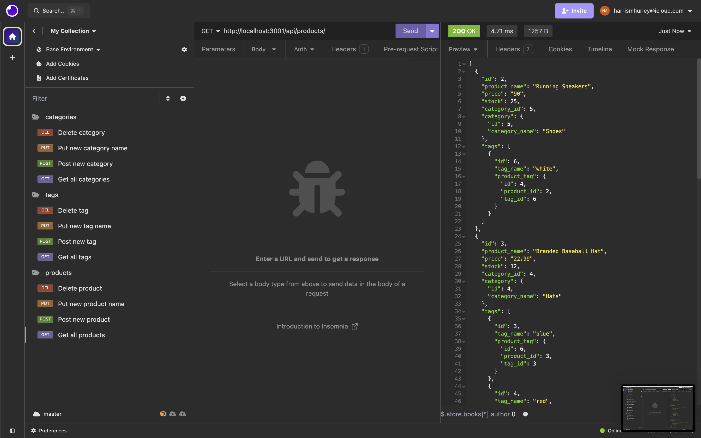

# ElectroShop
    

## Description

The E-commerce Back End project provides the foundational architecture for managing the backend of an e-commerce application. It leverages Express.js for server-side logic, Sequelize as the ORM to interact with a PostgreSQL database, and follows RESTful API principles for handling HTTP requests. This back end system allows for efficient management of products, categories, tags, and their associations, providing the essential CRUD (Create, Read, Update, Delete) operations needed for an e-commerce platform.

## Deployed Application URL

N/A

## Table of Contents
* [Installation](#installation)
* [Usage](#usage)
* [Credits](#credits)
* [Features](#features)
* [Dependencies](#dependencies)
* [Screenshots](#screenshots)
* [Walkthrough](#walkthrough)
* [How to Contribute](#how-to-contribute)
* [Tests](#tests)
* [License](#license)
* [Screenshots](#screenshots)

## Installation

- Clone repo off GitHub 'git clone git@github.com:harrismhurley/ElectroShop.git'
- run 'npm i' in integrated terminal to install dependencies
- run 'node seeds/index.js' to seed data

## Usage

To use this application, follow these steps:

- Insert your psql data into '.env.EXAMPLE' and rename it to '.env'
- Open db folder in terminal and run \i schema.sql in postgres
- Seed the database by running 'node seeds/index.js' in main directory
- Open the server by running 'node server.js'

## Credits


## Features

- Express.js Server: A robust and scalable server built with Express.js to handle API requests and serve data to the front end.
- Sequelize ORM: Integration with Sequelize to define models, relationships, and interact with the PostgreSQL database seamlessly.
- RESTful API Endpoints: Comprehensive endpoints for managing products, categories, and tags, enabling full CRUD operations.
- Database Relationships: Properly defined relationships between models to ensure data integrity and efficient querying.
- Environment Variables: Secure management of database credentials and other configuration settings using environment variables.

## Dependencies

- dotenv 8.2.0
- express 4.17.1
- pg 8.11.3
- semver 7.6.2
- sequelize 6.37.3

## Screenshots




## Walkthrough
[Walkthrough Video](https://drive.google.com/file/d/1wf_SfzZuGhFeZhi9V2J5RgPwue59FvxQ/view)

## How to Contribute

If you would like to contribute you can contact me [Via Email](mailto:harrismhurley@icloud.com?subject=[GitHub]%20Dev%20Connect) or visit [github](https://github.com/harrismhurley).

## Tests

To ensure your e-commerce back end is working correctly, you can use [Insomnia](https://insomnia.rest/) to perform various HTTP requests to the API endpoints. Below are the steps to test each type of request (GET, POST, PUT, DELETE):

### Categories

1. **GET all categories**
   - Method: `GET`
   - URL: `http://localhost:3001/api/categories`
   - Description: Retrieves all categories along with their associated products.

2. **GET a single category by ID**
   - Method: `GET`
   - URL: `http://localhost:3001/api/categories/:id`
   - Description: Retrieves a single category by its ID along with its associated products.
   - Example: `http://localhost:3001/api/categories/1`

3. **POST a new category**
   - Method: `POST`
   - URL: `http://localhost:3001/api/categories`
   - Description: Creates a new category.
   - JSON Body:
     ```json
     {
       "category_name": "New Category"
     }
     ```

4. **PUT update a category by ID**
   - Method: `PUT`
   - URL: `http://localhost:3001/api/categories/:id`
   - Description: Updates a category by its ID.
   - Example: `http://localhost:3001/api/categories/1`
   - JSON Body:
     ```json
     {
       "category_name": "Updated Category"
     }
     ```

5. **DELETE a category by ID**
   - Method: `DELETE`
   - URL: `http://localhost:3001/api/categories/:id`
   - Description: Deletes a category by its ID.
   - Example: `http://localhost:3001/api/categories/1`

### Products

1. **GET all products**
   - Method: `GET`
   - URL: `http://localhost:3001/api/products`
   - Description: Retrieves all products along with their associated categories and tags.

2. **GET a single product by ID**
   - Method: `GET`
   - URL: `http://localhost:3001/api/products/:id`
   - Description: Retrieves a single product by its ID along with its associated categories and tags.
   - Example: `http://localhost:3001/api/products/1`

3. **POST a new product**
   - Method: `POST`
   - URL: `http://localhost:3001/api/products`
   - Description: Creates a new product.
   - JSON Body:
     ```json
     {
       "product_name": "New Product",
       "price": 99.99,
       "stock": 50,
       "category_id": 1,
       "tagIds": [1, 2]
     }
     ```

4. **PUT update a product by ID**
   - Method: `PUT`
   - URL: `http://localhost:3001/api/products/:id`
   - Description: Updates a product by its ID.
   - Example: `http://localhost:3001/api/products/1`
   - JSON Body:
     ```json
     {
       "product_name": "Updated Product",
       "price": 89.99,
       "stock": 40,
       "category_id": 1,
       "tagIds": [1, 2, 3]
     }
     ```

5. **DELETE a product by ID**
   - Method: `DELETE`
   - URL: `http://localhost:3001/api/products/:id`
   - Description: Deletes a product by its ID.
   - Example: `http://localhost:3001/api/products/1`

### Tags

1. **GET all tags**
   - Method: `GET`
   - URL: `http://localhost:3001/api/tags`
   - Description: Retrieves all tags along with their associated products.

2. **GET a single tag by ID**
   - Method: `GET`
   - URL: `http://localhost:3001/api/tags/:id`
   - Description: Retrieves a single tag by its ID along with its associated products.
   - Example: `http://localhost:3001/api/tags/1`

3. **POST a new tag**
   - Method: `POST`
   - URL: `http://localhost:3001/api/tags`
   - Description: Creates a new tag.
   - JSON Body:
     ```json
     {
       "tag_name": "New Tag"
     }
     ```

4. **PUT update a tag by ID**
   - Method: `PUT`
   - URL: `http://localhost:3001/api/tags/:id`
   - Description: Updates a tag by its ID.
   - Example: `http://localhost:3001/api/tags/1`
   - JSON Body:
     ```json
     {
       "tag_name": "Updated Tag"
     }
     ```

5. **DELETE a tag by ID**
   - Method: `DELETE`
   - URL: `http://localhost:3001/api/tags/:id`
   - Description: Deletes a tag by its ID.
   - Example: `http://localhost:3001/api/tags/1'

## License 
This project is licensed under the [MIT](https://opensource.org/licenses/MIT) license.